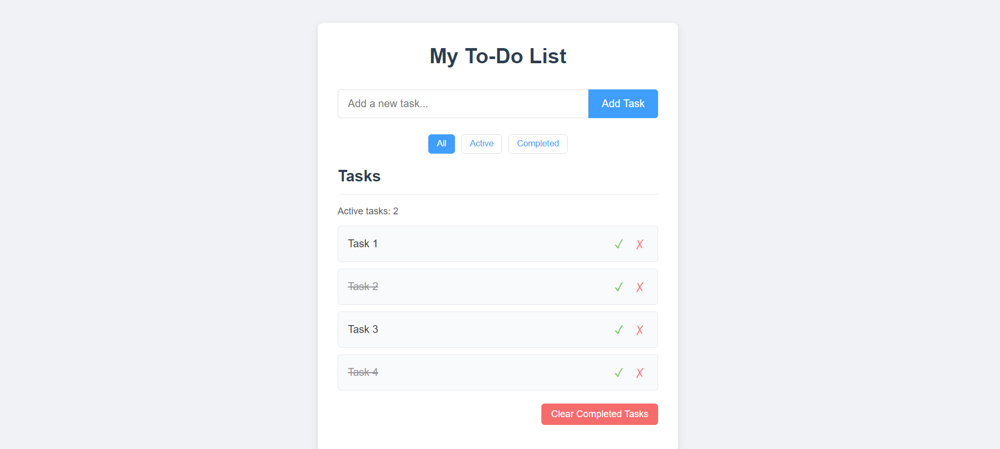

# Vanilla JS To-Do List Application

A clean, simple, and functional To-Do List application built (purely) with HTML, CSS, and Vanilla JavaScript. This project demonstrates fundamental web development concepts including DOM manipulation, event handling, and local storage for data persistence.

## Live Demo

[[Link to my live demo ](https://zakkur17.github.io/todo-list-app/)]

## Features

*   **Add Tasks:** Easily add new tasks to your to-do list.
*   **Complete Tasks:** Mark tasks as completed with a visual strikethrough.
*   **Delete Tasks:** Remove tasks you no longer need.
*   **Persistent Storage:** Tasks are saved to the browser's Local Storage, so they remain even after closing or refreshing the page.
*   **Task Counter:** Displays the number of active (incomplete) tasks.
*   **Clear Completed:** Quickly remove all completed tasks with a single click.
*   **Filter Tasks:** View all tasks, only active tasks, or only completed tasks.
*   **Responsive Design:** The application is designed to work (well) on different screen sizes.

## Screenshot



## Technologies Used

*   **HTML5:** For the basic structure and content of the application.
*   **CSS3:** For styling the application, including layout (Flexbox), visual appearance, and responsiveness.
*   **Vanilla JavaScript (ES6+):** For all the application logic, including:
    *   DOM manipulation (creating, reading, updating, and deleting elements).
    *   Event handling (form submissions, button clicks).
    *   Implementing core to-do list functionalities.
    *   Utilizing Local Storage API for data persistence.
    *   Dynamic filtering and counting of tasks.

## Project Setup and Usage

1.  **Clone the repository (or download the files):**
    ```bash
    git clone https://github.com/Zakkur17/todo-list-app.git
    ```
2.  **Navigate to the project directory:**
    ```bash
    cd todo-list-app
    ```
3.  **Open `index.html` in your web browser.**
    No build steps or dependencies are required as this is a Vanilla JavaScript project.

## Code Structure

*   `index.html`: The main HTML file containing the structure of the application.
*   `style.css`: Contains all the CSS rules for styling the application.
*   `script.js`: Contains all the JavaScript code for the application's functionality.

## Key Learning Points & Functionality Overview

*   **DOM Manipulation:** Dynamically creating `<li>` elements for tasks, along with `<span>` for text and `<button>` elements for actions. Appending and removing these elements from the DOM.
*   **Event Handling:**
    *   Listening for `submit` events on the task input form.
    *   Using event delegation on the task list (`<ul>`) to handle clicks on complete/delete buttons for dynamically added tasks.
    *   Handling clicks for filter buttons and the "Clear Completed" button.
*   **Local Storage:**
    *   Saving the current list of tasks (as an array of objects, stringified to JSON) to `localStorage` whenever a task is added, modified (completed status), or deleted.
    *   Loading tasks from `localStorage` when the page initializes, parsing the JSON string back into an array, and re-rendering the tasks.
*   **Filtering Logic:** Implementing client-side filtering to show/hide tasks based on their completion status by toggling a CSS class.
*   **Dynamic Updates:** Updating the active task counter (in response to) user actions.

## Future Enhancements (Optional)

*   Ability to edit existing tasks.
*   Drag-and-drop functionality to reorder tasks.
*   Due dates or priority levels for tasks.
*   More advanced filtering or sorting options.
*   User authentication (would require a backend).

## Author

*   **Zakkur Lie-A-Ling**
*   GitHub: [@Zakkur17](https://github.com/Zakkur17)
*   LinkedIn: https://www.linkedin.com/in/zakkurliealing/
